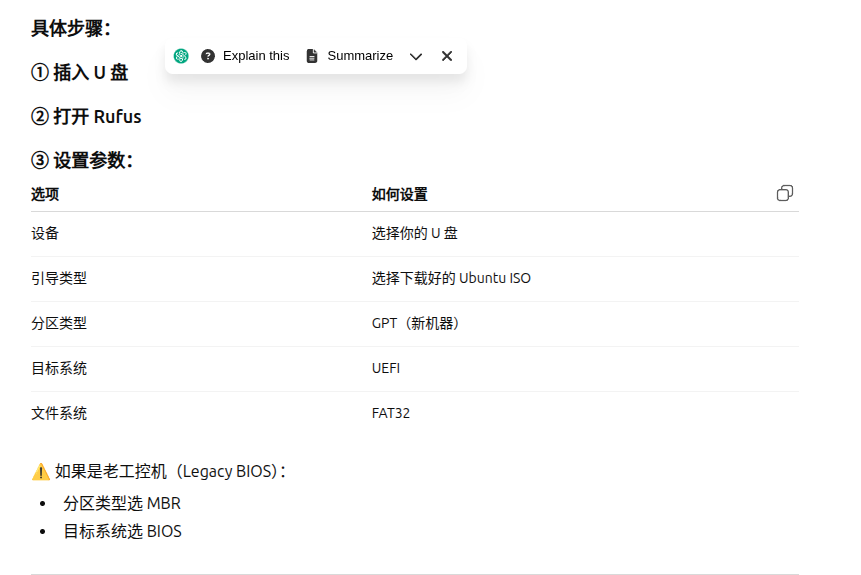
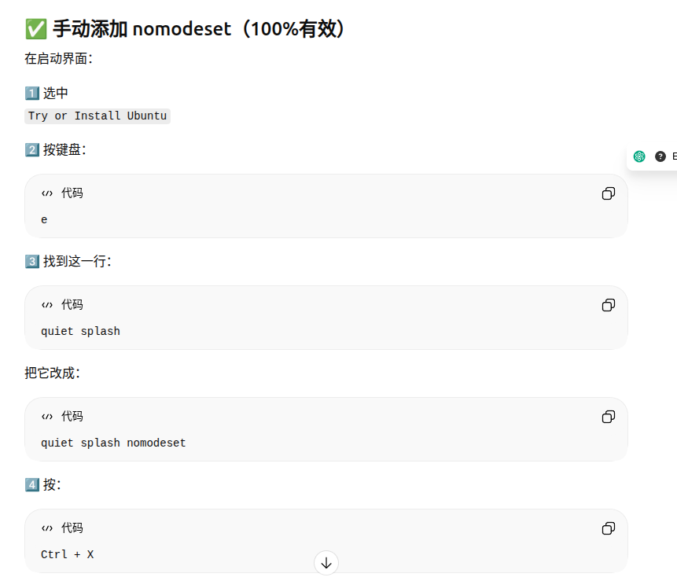
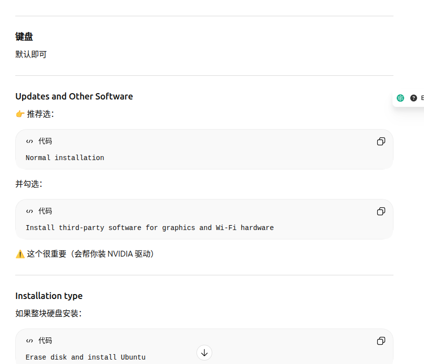

<!-- TOC -->

# ubuntu24.04重装
## ubuntu 转移数据代码

- 找到外接硬盘和本地硬盘home所在的位置
  
  查看位置命令
  ```python 
  lsblk -f
  ```
  找到原来的分区并挂在本地磁盘挂在root上,外界硬盘挂在usb上
  ```python 
    sudo mkdir /mnt/root
    #本地磁盘挂在root上,
    sudo mount /dev/sda2 /mnt/root
    sudo mkdir /mnt/usb
    #外界硬盘挂在usb上
    sudo mount /dev/sdac1 /mnt/usb
    #复制
    sudo cp -a /mnt/root/home /media/usb/
    #外界硬盘不支持保留 Linux 权限和符号链接，则用这种方式复制
    sudo rsync -a --no-perms --no-owner --no-group /mnt/root/home/ /mnt/usb/home/
    #卸载外接硬盘
    sudo umount /mnt/usb
    sudo umount /mnt/root
    sudo apt update
    sudo ubuntu-drivers autoinstall
    #重启
    sudo reboot
    
## u盘启动盘制作
ubuntu24.04 desktop 清华镜像源下载
  https://mirrors.tuna.tsinghua.edu.cn/ubuntu-releases/24.04.4/
  rufus下载链接
  https://rufus.ie/zh/
  参数设置


## 系统重装
  开机按ESC,进入BIOS
  把USB调到第一个然后保存进入重装系统
  
  显卡是4090，安装的时候会出现花屏：
  

  进入后先安装驱动
 -正常默认即可
  然后重启拔掉u盘
  
  
# 软件安装

- 远程在github里面搜clash verge在里面找对应版本
- anaconda3去清华镜像源下载安装
  ```python
  #清华镜像源下载
  https://mirrors.tuna.tsinghua.edu.cn/anaconda/archive/
  #pytorch安装要确定对应cuda版本，显卡型号
  pip install torch torchvision torchaudio --index-url https://download.pytorch.org/whl/cu124
  #- 中文输入法安装
  sudo apt update
  sudo apt install fcitx5 fcitx5-chinese-addons -y
然后在 Ubuntu 顶部右上角系统托盘可以看到 Fcitx 图标，点击 → 添加 Chinese (Pinyin)